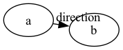
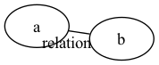

# Graphviz sample

Simple samples to get graph png files from `.dot` files.

You need to install [Graphviz](https://graphviz.org/) before getting started.


## Simple directed graph

### Source code ( `digraph.dot` )

```
digraph {
  a->b;
}
```


### Command ( [Graphviz](https://graphviz.org/) required)

```shell
neato -Tpng -O digraph.dot
```


### Output ( `digraph.dot.png` )



## Simple undirected graph

### Source code ( `undigraph.dot` )

```
graph {
  a--b;
}
```


### Command ( [Graphviz](https://graphviz.org/) required)

```shell
neato -Tpng -O undigraph.dot
```


### Output ( `undigraph.dot.png` )



## 
